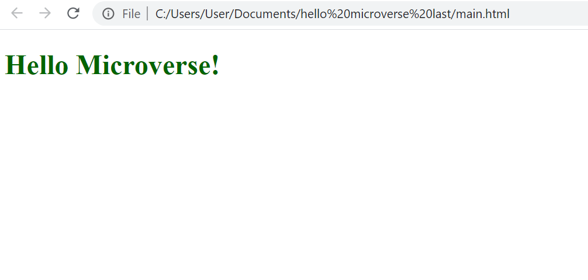

# Hello Microverse

> Set up a "Hello Microverse" project.

Simple project using HTML and CSS with text "Hello Microverse!"

## Built With

- HTML/CSS
- Node.JS

## Getting Started

To get a local copy up and running follow these simple example steps.

Make sue that all files in same folder.

### Prerequisites

- Node.JS

## Author

👤 **Elmar Abdulkarimov**

- GitHub: [@elmar8287](https://github.com/elmar8287)

## 🤝 Contributing

Contributions, issues, and feature requests are welcome!

Feel free to check the [issues page](../../issues/).

## Show your support

Give a ⭐️ if you like this project!

## Acknowledgments

- Microverse
